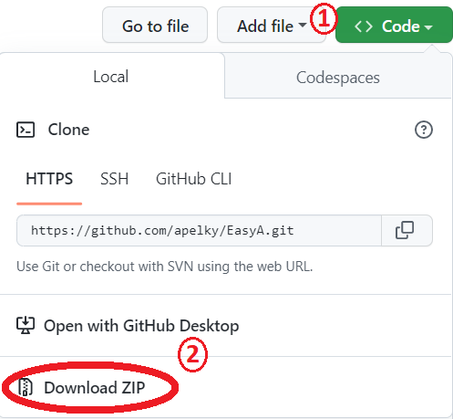
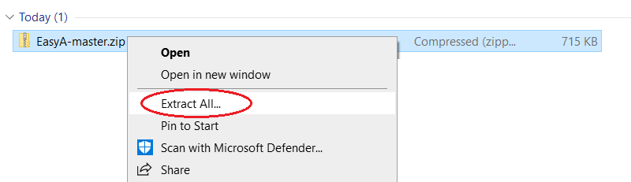

# EasyA 2.0
Here in the `README.md` file, you'll find information on the repository, and instructions on how to setup and use EasyA. 
**Table of Contents**
 - Description
 - How to Install
 - How to Use EasyA
 - Files
 - Contributors

## Description
EasyA is a program that allows college students to search which classes and instructors give the most As and/or Ds & Fs. This tool is designed to give the user more information about the statistics of the class.

## How to Install

### Software Dependencies
This program uses Python3 & a python library matplotlib. 

***Both Python3 & matplotlib must be downloaded & installed on your device in order for EasyA to function properly.*** 

1) Download the [latest version of Python](https://www.python.org/downloads/) for your device 
2) Open the command prompt (or terminal on Mac), and type in this command:
			`pip3 install matplotlib`

*(If you aren't using python 3 and have an older version of python, try typing the same command using `pip` instead of `pip3`)* 

### EasyA Installation
1)  **Download.** Click on the green "<> Code" button above the repo, then select the "Download ZIP" option. This will download the contents of the repo onto your local machine  
  

2)  **Unzip.** Open up to your Downloads in File Explorer/Finder and right-click on the zip folder you just downloaded. Then select the "Extract All" option, then press confirm by pressing "Extract".  
  
This will decompress the contents of the file, and allow you to now view and execute the files.  

At this point, EasyA is installed and ready to be run!

## How to Use EasyA

1) **Run EasyA.py.** Open up your command prompt (or terminal if on Mac), and navigate to your EasyA file you just unzipped. 

&nbsp;&nbsp;&nbsp;&nbsp;&nbsp;&nbsp;&nbsp;&nbsp;&nbsp;&nbsp;&nbsp;&nbsp;&nbsp;&nbsp;&nbsp;`cd Downloads/EasyA-master/EasyA-master`  

&nbsp;&nbsp;&nbsp;&nbsp;&nbsp;If you moved the EasyA folder out of of the Downloads folder, you'll need to find and type the correct path to the folder: 

&nbsp;&nbsp;&nbsp;&nbsp;&nbsp;&nbsp;&nbsp;&nbsp;&nbsp;&nbsp;&nbsp;&nbsp;&nbsp;&nbsp;&nbsp;`cd insert/your/path/to/folder/EasyA-master`  
&nbsp;&nbsp;&nbsp;&nbsp;&nbsp;Once you're in the correct folder, *(can check folder's contents by using `dir` (Windows) or `ls` (Mac))*, execute the `EasyA.py` file by typing the following command: 

&nbsp;&nbsp;&nbsp;&nbsp;&nbsp;&nbsp;&nbsp;&nbsp;&nbsp;&nbsp;&nbsp;&nbsp;&nbsp;&nbsp;&nbsp;`python3 EasyA.py`  
&nbsp;&nbsp;&nbsp;&nbsp;&nbsp;*(If you aren't using python 3 and have an older version of python, try typing the same command using `python` instead of `python3`)* 
This will use python to execute the EasyA program.   

2) **Provide Input.** Now that the program is running, a window will pop up with a few options. Here's what each option does: 

button1 -- placeholder 
button2 -- placeholder 

`Now waiting for UI to near completion to geta grasp of options provided insteado fhaving to redo this section #FIXME` 

3) **View Graph.** After you have inputted the specifics of what you would like to see, the EasyA program has saved the graph as a .PDF in the "pdfs" folder. Find the EasyA folder on your local device via file explorer/finder, and open the desired 

`image to come later #FIXME` 

### Administrator Use 
What flags do we need here? #FIXME 

## Files
**Main Files** 
`EasyA.py`&nbsp;&nbsp;&nbsp;&nbsp;&nbsp;&nbsp;&nbsp;&nbsp;&nbsp;&nbsp;&nbsp;&nbsp;&nbsp;-- Main executable to run the program 
`Course_Class.py` -- Declaration of python class, "Course" 
`Graph_class.py` &nbsp;-- Declaration of python class, "Graph" 
`User_Input.py` &nbsp;&nbsp;&nbsp;-- Functions for getting input from user 
`functions.py` &nbsp;&nbsp;&nbsp;&nbsp;&nbsp;-- Various functions to process data into a plottable format 

**Parsing & Data Files** 
`GradeData.txt` &nbsp;&nbsp;&nbsp;&nbsp;&nbsp;&nbsp;&nbsp;&nbsp;&nbsp;&nbsp;&nbsp;&nbsp;-- All data 
`GradeData.py`   &nbsp;&nbsp;&nbsp;&nbsp;&nbsp;&nbsp;&nbsp;&nbsp;&nbsp;&nbsp;&nbsp;&nbsp;&nbsp;&nbsp;-- Functions to parse `GradeData.txt` and convert into a list 
`Regular_Faculty.txt` -- List of Faculty members 
`Faculty_Parser.py` &nbsp;&nbsp;&nbsp;&nbsp;-- Functions to parse 
`Regular_Faculty.txt` and convert into a list 

**Testing Files** 
`APTest.txt` &nbsp;&nbsp;&nbsp;&nbsp;&nbsp;&nbsp;&nbsp;&nbsp;&nbsp;&nbsp;&nbsp;&nbsp;&nbsp;&nbsp;&nbsp;&nbsp;&nbsp;&nbsp;&nbsp;&nbsp;&nbsp;&nbsp;&nbsp;&nbsp;&nbsp;&nbsp;-- Test file for editing 
`GradeData_SmallTest.py` &nbsp;&nbsp;-- Test file for testing  
`GradeData_SmallTest.txt` -- Small version of GradeData for testing 
`TestCases.py` &nbsp;&nbsp;&nbsp;&nbsp;&nbsp;&nbsp;&nbsp;&nbsp;&nbsp;&nbsp;&nbsp;&nbsp;&nbsp;&nbsp;&nbsp;&nbsp;&nbsp;&nbsp;&nbsp;&nbsp;&nbsp;&nbsp;-- Various Test cases for functions 
`tkinter_test.py` &nbsp;&nbsp;&nbsp;&nbsp;&nbsp;&nbsp;&nbsp;&nbsp;&nbsp;&nbsp;&nbsp;&nbsp;&nbsp;&nbsp;&nbsp;&nbsp;-- File for testing Tkinter 

**Folders** 
`images`&nbsp;&nbsp;&nbsp;-- Folder for holding image assets for README file 
`pdfs`&nbsp;&nbsp;&nbsp;&nbsp;&nbsp;&nbsp;&nbsp;-- Folder for holding saved .PDF files onces downloaded onto a local machine 

## Contributors
**Authors:** Ethan Aasheim, Melodie Collins, Linnea Gilius, Timothy Nadeau, Angela Pelky 
**Created:** 1/16/23 by Angela Pelky 
